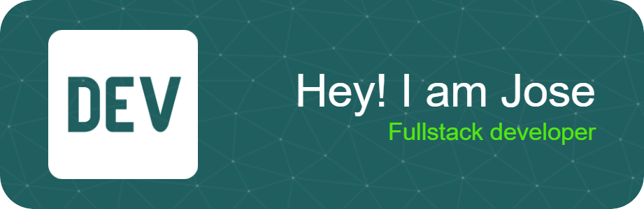

  
</div

Hola, soy Jose, un apasionado programador full stack con experiencia en el desarrollo de soluciones innovadoras y escalables. Mi trayectoria abarca desde la creación de interfaces de usuario intuitivas y eficientes hasta la implementación de robustos sistemas back-end.

<<<<<<< HEAD
# Skills 

=======
# Skills 

##ESTADISTICAS DEL REPOSITORIO

